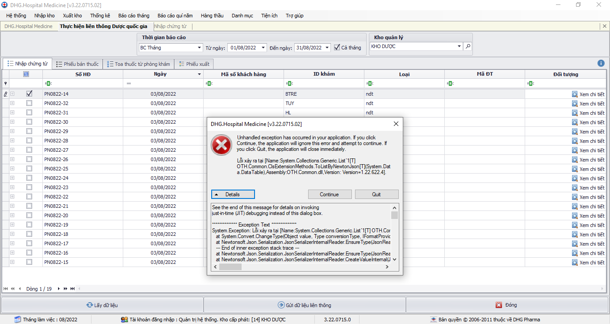

### DHG.Hospital Admin - Thông tin cập nhật

(✨: Chức năng mới,🐛: Chỉnh lỗi, #️⃣: Giải quyết công việc) 

##### [v3.22.1023.3]()

-  ✨: Thực hiện cấu hình kết nối với thẻ khám bệnh viettin
-  #️⃣: https://github.com/dh-hos/dhg.hospitaladmin/issues/22

##### [v3.22.1023.1]()

-  ✨: Thực hiện cấu hình kết nối với thẻ khám bệnh viettin
-  #️⃣: https://github.com/dh-hos/dhg.hospitaladmin/issues/22

##### [v3.22.0930.1]()

-  #️⃣: Fix lỗi không thể xem chi tiết trên form gửi dữ liệu liên thông Dược Quốc Gia 
-  #️⃣: https://github.com/dh-hos/dhg.hospitaladmin/issues/20

##### [v3.22.0929.1]()

-  ✨: Hỗ trợ xóa XML (không có chi phí gửi BHXH) trên bảng kê kiểm tra XML
-  #️⃣: https://github.com/dh-hos/dhg.hospitaladmin/issues/21
-  ✨: Thực hiện theo Mô tả thực hiện Thông tư 36/2021/TT-BYT [Mô tả](https://github.com/dh-hos/Mo-ta-he-thong/files/9553579/Vinh.-.Mo.ta.cap.phat.thuoc.nguoi.benh.Lao.theo.TT36.va.CV3153.-.17-08-2022v2.pdf)
-  ✨: Hỗ trợ không cập nhật lại kết quả chuẩn đoán đối với bệnh nhân Lao theo Thông tư 36/2021/TT-BYT (đã ghi nhận khi in phiếu 01) khi xem XML hoặc gửi XML lên cổng BHXH
-  #️⃣: https://github.com/dh-hos/Mo-ta-he-thong/issues/12

##### [v3.22.0928.1]()

-  ✨: Cập nhật bản quyền đối với Mã BV 87190 - BỆNH VIỆN DA LIỄU ĐỒNG THÁP
-  #️⃣: https://github.com/dh-hos/DH.HIS/issues/4

##### [v3.22.0924.1]()

-  ✨: Thực hiện theo Mô tả thực hiện Thông tư 36/2021/TT-BYT [Mô tả](https://github.com/dh-hos/Mo-ta-he-thong/files/9553579/Vinh.-.Mo.ta.cap.phat.thuoc.nguoi.benh.Lao.theo.TT36.va.CV3153.-.17-08-2022v2.pdf)
-  #️⃣: https://github.com/dh-hos/Mo-ta-he-thong/issues/12

##### [v3.22.0721.1]()

-  🐛: Bổ sung license mabvbh=77150
-  #️⃣: https://github.com/dh-hos/DH.HIS/issues/2

##### [v3.22.0719.1]()

-  ✨: Cập nhật ngày giờ y lệnh trên xml 3 theo mô tả mới
-  #️⃣: https://github.com/dh-hos/dhg.hospitaladmin/issues/18

##### [v3.22.0704.1]()

-  🐛: Lỗi khi Tạo lập bộ bảng lưu trữ cắt bỏ dữ liệu trực tiếp qua cơ sở dữ liệu khác (Admin -> tiện ích -> Cắt bỏ dữ liệu ra CSDL lưu trữ -> Kết chuyển dữ liệu trực tiếp -> Tạo lập bộ bảng lưu trữ)
-  #️⃣: https://github.com/dh-hos/dhg.hospitaladmin/issues/17

##### [v3.22.0703.1]()

-  ✨: Xuất NGAY_YL, NGAY_KQ theo mô tả (#11) (Vinh - Mo ta cot [dien_bien] [hoi_chan] va [phau_thuat] XML5 - 20220602.3.pdf), lấy theo ngày giờ bắt đầu và kết thúc nếu có lập phiếu phẫu thuật
-  #️⃣: https://github.com/dh-hos/Mo-ta-he-thong/issues/11
