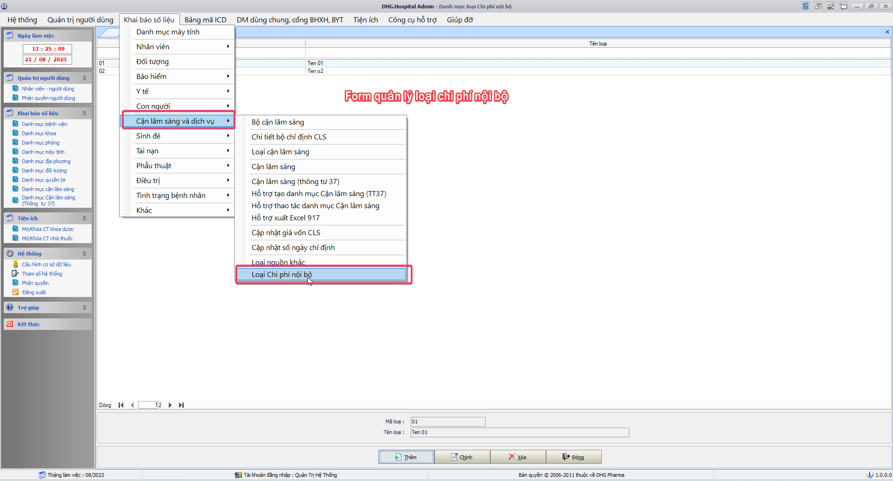
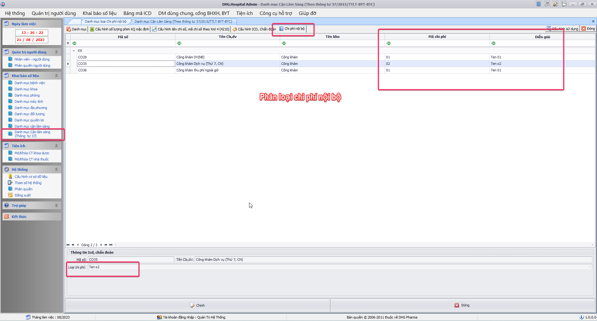
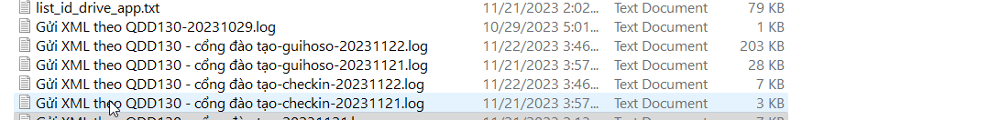
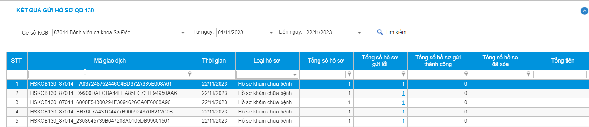
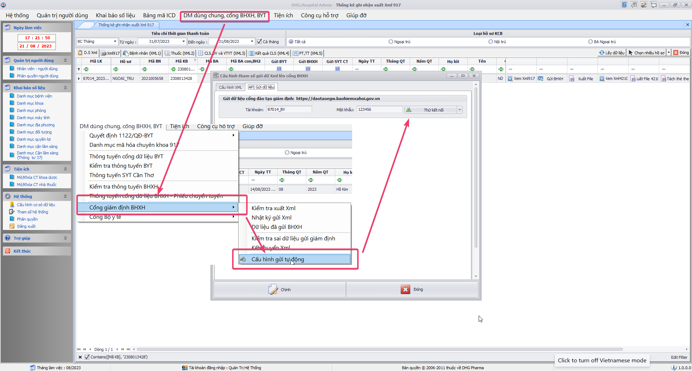
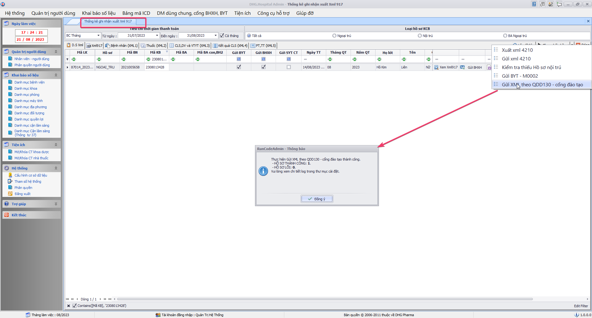
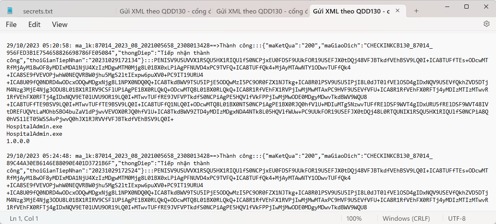

### DHG.Hospital Admin - Thông tin cập nhật

(✨: Chức năng mới,🐛: Chỉnh lỗi, #️⃣: Giải quyết công việc) 

##### [v3.24.0203.1]()

-  ✨:
-  🐛:
-  #️⃣:

##### [v3.24.0131.1]()

-  ✨:
-  🐛:
-  #️⃣:

##### [v3.24.0129.1]()

-  ✨:
-  🐛:
-  #️⃣:

##### [v3.24.0127.1]()

-  ✨:
-  🐛:
-  #️⃣:

##### [v3.24.0124.1]()

-  ✨:
-  🐛:
-  #️⃣:

##### [v3.24.0104.1]()

-  ✨:
-  🐛:
-  #️⃣:

##### [v3.23.1231.2]()

-  ✨:
-  🐛:
-  #️⃣:

##### [v3.23.1231.1]()

-  ✨:
-  🐛:
-  #️⃣:

##### [v3.23.1209.1]()

- #️⃣: <https://github.com/dh-hos/To_Lap_Trinh/issues/186>
- #️⃣: <https://github.com/dh-hos/To_Lap_Trinh/issues/185>
- ✨: Bổ sung Control trên Form danh mục CLS cập nhật giá trị cột dmcls.maicd9 (tương ứng cột [Mã ICD-9] phụ lục 3 QĐ 4440)
- ✨: Mở rộng form danh mục cận lâm sàng cho phép cập nhật [Mã chỉ số] và [Tên chỉ số] đối với kho: HA (chẩn đoán hình ảnh) và CN (Thăm dò chức năng).
- ✨: Cho phép thêm mới, thay đổi nhãn “Mã Medisoft” thành “Mã BYT” trên form [Danh mục kết quả điều trị]

##### [v3.23.1201.1]()

-  ✨:
-  🐛:
-  #️⃣:

##### [v3.23.1130.2]()

- ✨: Thêm chức năng phân loại chi phí nội bộ trên danh mục cận lâm sàng [Theo mô tả](https://github.com/dh-hos/Mo-ta-he-thong/blob/main/FEES/Hau-quan-ly-loai-chi-phi-noi-bo.md)

##### [v3.23.1130.1]()

- ✨: Thêm chức năng phân loại chi phí nội bộ trên danh mục cận lâm sàng [Theo mô tả](https://github.com/dh-hos/Mo-ta-he-thong/blob/main/FEES/Hau-quan-ly-loai-chi-phi-noi-bo.md)

##### [v3.23.1122.2]()

- ✨: Tách ghi nhận log riêng giữa checkIn và hosoKcb 
- ✨: Thêm chức năng gửi checkIn theo QĐ130 hồ sơ khám chữa bệnh, cùng chức năng gửi QĐ130

##### [v3.23.1122.1]()

- ✨: Thêm chức năng gửi checkIn theo QĐ130 hồ sơ khám chữa bệnh

##### [v3.23.1029.1]()

- #️⃣: <https://github.com/dh-hos/dhg.hospitaladmin/issues/49>
- ✨: Thêm chức năng gửi checkIn theo QĐ130 lên cổng đào tạo trên form quản lý xuất xml
- 🐛: Fix Lỗi - Hiệu chỉnh thông tin không cập nhật được tuyenxml (`Thay Plus.dll bằng HosReg.Plus.dll`)

##### [v3.23.1016.4]()

- #️⃣: <https://github.com/dh-hos/To_Lap_Trinh/issues/126>
- ✨: Yêu cầu - Cấp license thêm mã đơn vị triển khai mới - BV Đa Khoa Tâm Minh Đức Tiền Giang

##### [v3.23.1016.3]()

- #️⃣: <https://github.com/dh-hos/To_Lap_Trinh/issues/126>
- ✨: Yêu cầu - Cấp license thêm mã đơn vị triển khai mới - BV Đa Khoa Tâm Minh Đức Tiền Giang

##### [v3.23.1016.2]()

- #️⃣: <https://github.com/dh-hos/To_Lap_Trinh/issues/126>
- ✨: Yêu cầu - Cấp license thêm mã đơn vị triển khai mới - BV Đa Khoa Tâm Minh Đức Tiền Giang

##### [v3.23.1016.1]()

- #️⃣: <https://github.com/dh-hos/To_Lap_Trinh/issues/126>
- ✨: Yêu cầu - Cấp license thêm mã đơn vị triển khai mới - BV Đa Khoa Tâm Minh Đức Tiền Giang

##### [v3.23.0921.1]()

- #️⃣: <https://github.com/dh-hos/To_Lap_Trinh/issues/90#issuecomment-1729169695>
- ✨: Chỉnh thông tin bệnh nhân ngoại trú: bổ sung chức năng nhập lại mã nơi đăng ký ban đầu xác định trái tuyến được hưởng như cùng tuyến.

##### [v3.23.0911.2]()

- #️⃣: <https://github.com/dh-hos/dhg.hospitaladmin/issues/46>
- 🐛: Fix Lỗi - Dữ liệu đã gửi BHXH lỗi khi lấy dữ liệu

##### [v3.23.0911.1]()

- #️⃣: <https://github.com/dh-hos/dhg.hospitaladmin/issues/47>
- 🐛: Fix Lỗi - Liên thông Dược quốc gia số lượng thuốc lớn hơn kiểu dữ liệu Int16

##### [v3.23.0904.3]()

- #️⃣: <https://github.com/dh-hos/To_Lap_Trinh/issues/63>
- ✨: Không kiểm tra XML2.NGAY_YL so với NGAY_RA, dữ liệu ghi nhận thế nào thì xuất XML như dữ liệu ghi nhận (trước đây nếu NGAY_YL > NGAY_RA, thì lấy NGAY_YL = NGAY_RA)

##### [v3.23.0904.2]()

-  ✨:
-  🐛:
-  #️⃣:

##### [v3.23.0904.1]()

- #️⃣: <https://github.com/dh-hos/To_Lap_Trinh/issues/44>
- ✨: Thực hiện Yêu cầu - Gửi cổng giám định, không gửi XML4 những XN không có kết quả. (Loại bỏ những dịch vụ, cls khi gia_tri rỗng)

##### [v3.23.0810.1]()

- ✨: Bổ sung chức năng thanh toán QRCode đối với bệnh viện Tim Mạch CT (92001)

##### [v3.23.0623.2]()

- #️⃣: <https://github.com/dh-hos/dhg.hospitalsecondstore/issues/9>
- ✨: Bổ sung nhật ký khi thực hiện Tạo hoặc Xóa cấu trúc âm kho

##### [v3.23.0623.1]()

- #️⃣: <https://github.com/dh-hos/Mo-ta-he-thong/issues/25>
- ✨: Cập nhật Lisence `92117`

##### [v3.23.0621.1]()

- #️⃣: <https://github.com/dh-hos/dhg.hospitaladmin/issues/43>
- ✨: Cập nhật Lisence `77155`

##### [v3.23.0616.2]()

- #️⃣: <https://github.com/dh-hos/dhg.hospitalservices/issues/16>
- ✨: Thêm chức năng Phẫu thuật phương pháp vô cảm theo cấu hình tham số `XML.vocamgayte.cauhinh` ([Mô tả](https://github.com/dh-hos/Mo-ta-he-thong/blob/main/XML4210/20230415-Hau-CV1731-BHXH-G%C4%90%C4%90T-Thanh-toan-phau-thuat-vo-cam-gay-te.md))

##### [v3.23.0616.1]()

- #️⃣: <https://github.com/dh-hos/dhg.hospitalservices/issues/16>
- ✨: Thêm chức năng Phẫu thuật phương pháp vô cảm theo cấu hình tham số `XML.vocamgayte.cauhinh` ([Mô tả](https://github.com/dh-hos/Mo-ta-he-thong/blob/main/XML4210/20230415-Hau-CV1731-BHXH-G%C4%90%C4%90T-Thanh-toan-phau-thuat-vo-cam-gay-te.md))

##### [v3.23.0606.1]()

- #️⃣: <https://github.com/dh-hos/dhg.hospitaladmin/issues/42#issuecomment-1578201157>
- ✨: Cập nhật Lisence `77156`

##### [v3.23.0515.2]()

- #️⃣: <https://github.com/dh-hos/dhg.hospitaladmin/issues/24>
- ✨: Ghi nhận nhật ký thay đổi khi chỉnh hồ sơ Nội trú và ngoại trú

##### [v3.23.0515.1]()

- #️⃣: <https://github.com/dh-hos/dhg.hospitaladmin/issues/36>

##### [v3.23.0511.1]()

- #️⃣: <https://github.com/dh-hos/dhg.hospitaladmin/issues/37>
- 🐛: Kiểm tra trùng MA_BAC_SI trong XML3 khi lấy tất cả bác sĩ theo [Mô tả](https://github.com/dh-hos/Mo-ta-he-thong/blob/main/XML4210/Vinh-Mo-ta-XML4210-XML3.MA_BAC_SI.md)

##### [v3.23.0508.1]()

- #️⃣: <https://github.com/dh-hos/Mo-ta-he-thong/blob/main/XML4210/Vinh-Mo-ta-XML4210-XML3.MA_BAC_SI.md>
- #️⃣: <https://github.com/dh-hos/dhg.hospitaladmin/issues/31>
- ✨: Thực hiện xuất XML3, lấy tất cả mã nhân viên chỉ định và thực hiện cận lâm sàng, ekip phẫu thuật

##### [v3.23.0505.4]()

- 🐛: Fix lỗi thiếu _GT đối với thuốc sử dụng cho Phẫu thuật phương pháp vô cảm.

##### [v3.23.0505.3]()

- #️⃣: <https://github.com/dh-hos/dhg.hospitaladmin/issues/32#issuecomment-1535670102>
- 🐛: Fix lỗi ghi nhận sai MA_DICH_VU và TEN_DICH_VU đối với thuốc khi có Phẫu thuật phương pháp vô cảm, những trường hợp này giữ nguyên MA_VAT_TU và TEN_VAT_TU.

##### [v3.23.0505.2]()

- #️⃣: <https://github.com/dh-hos/dhg.hospitaladmin/issues/32>
- 🐛: Fix lỗi thiếu "[gây tê]" sau tên vật tư trên XML3

##### [v3.23.0505.1]()

- #️⃣: <https://github.com/dh-hos/dhg.hospitaladmin/issues/32#issuecomment-1535648183>
- 🐛: Fix lỗi thiếu "[gây tê]" sau tên vật tư trên XML3

##### [v3.23.0504.1]()

- #️⃣: <https://github.com/dh-hos/dhg.hospitaladmin/issues/32>
- ✨: Bổ sung xuất XML theo [Mô tả Phẫu thuật thuộc phương pháp vô cảm gây tê](https://github.com/dh-hos/Mo-ta-he-thong/blob/main/XML4210/20230415-Hau-CV1731-BHXH-G%C4%90%C4%90T-Thanh-toan-phau-thuat-vo-cam-gay-te.md)

##### [v3.23.0425.1]()

- #️⃣: <https://github.com/dh-hos/dhg.hospitaladmin/issues/35>
- ✨: Hỗ trợ mở rộng độ dài mã máy thực hiện cận lâm sàng

##### [v3.23.0421.2]()

- 🐛: Fix lỗi gán thẻ khi thanh toán không tiền mặt bằng thẻ Viettinbank v2

##### [v3.23.0421.1]()

- 🐛: Fix lỗi gán thẻ khi thanh toán không tiền mặt bằng thẻ Viettinbank

##### [v3.23.0418.1]()

- #️⃣: <https://github.com/dh-hos/dhg.hospitaladmin/issues/32>
- ✨: Bổ sung check box để xác định Phẫu thuật thuộc phương pháp vô cảm gây tê, phục vụ cho việc THANH TOÁN PHẪU THUẬT SỬ DỤNG PHƯƠNG PHÁP VÔ CẢM GÂY TÊ. 

##### [v3.23.0412.1]()

- #️⃣: <https://github.com/dh-hos/dhg.hospitaladmin/issues/29>
- ✨: Bổ sung chức năng xuất xml tự động gửi lên cổng Sở y tế Đồng Tháp (87197 - cs2 bv Lấp Vò)

##### [v3.23.0411.2]()

- #️⃣: <https://github.com/dh-hos/dhg.hospitaladmin/issues/28>
- ✨: Bổ sung chức năng xuất xml tự động gửi lên cổng Sở y tế Đồng Tháp (87196 - cs2 bv Thanh Bình)

##### [v3.23.0411.1]()

- ✨: Cập nhật thêm chức năng cấu hình tham số kết nối gửi tin nhắn đối với Vinaphone 

##### [v3.23.0109.2]()

- ✨:
- 🐛:
- #️⃣:

##### [v3.23.0109.1]()

- #️⃣: <https://github.com/dh-hos/dhg.hospitaladmin/issues/27>
- ✨: Cập nhật bản quyền đối với Mã BV 87192; 87196

##### [v3.22.1226.1]()

- #️⃣: <https://github.com/dh-hos/Mo-ta-he-thong/issues/21>
- #️⃣: <https://github.com/dh-hos/dhg.hospitaladmin/issues/25>
- ✨: Cập nhật bản quyền đối với Mã BV 92137; 77154

##### [v3.22.1107.1]()

- #️⃣: <https://github.com/dh-hos/Mo-ta-he-thong/issues/18>
- ✨: Hỗ trợ xuất XML theo mô tả [MÃ HÓA HÌNH THỨC KHÁM BỆNH, CHỮA BỆNH ĐỐI VỚI BỆNH NHÂN ĐIỀU TRỊ NỘI TRÚ 4h TRỞ XUỐNG](https://github.com/dh-hos/Mo-ta-he-thong/blob/main/XML4210/Hau-Mo-ta-XML-Noi-tru-4h-3788_BYT-BH.md)

##### [v3.22.1028.2]()

- 🐛: Fix lỗi không theo mô tả [Vinh.-.Mo.ta.cap.phat.thuoc.nguoi.benh.Lao.theo.TT36.va.CV3153.-.17-08-2022v2](../MoTaThayDoi/Vinh.-.Mo.ta.cap.phat.thuoc.nguoi.benh.Lao.theo.TT36.va.CV3153.-.17-08-2022v2.pdf). Xử lý chỉ cần psdangky.benhnhan_lao = 1 không cần chuẩn đoán Z22.7 sẽ thực hiện xuất xml theo MA_LYDO_VVIEN=7, MA_LOAI_KCB=7
- #️⃣: <https://github.com/dh-hos/dhg.hospitaladmin/issues/23>

##### [v3.22.1023.3]()

- ✨: Thực hiện cấu hình kết nối với thẻ khám bệnh viettin
- #️⃣: <https://github.com/dh-hos/dhg.hospitaladmin/issues/22>

##### [v3.22.1023.1]()

- ✨: Thực hiện cấu hình kết nối với thẻ khám bệnh viettin
- #️⃣: <https://github.com/dh-hos/dhg.hospitaladmin/issues/22>

##### [v3.22.0930.1]()

- #️⃣: Fix lỗi không thể xem chi tiết trên form gửi dữ liệu liên thông Dược Quốc Gia 
- #️⃣: <https://github.com/dh-hos/dhg.hospitaladmin/issues/20>

##### [v3.22.0929.1]()

- ✨: Hỗ trợ xóa XML (không có chi phí gửi BHXH) trên bảng kê kiểm tra XML
- #️⃣: <https://github.com/dh-hos/dhg.hospitaladmin/issues/21>
- ✨: Thực hiện theo Mô tả thực hiện Thông tư 36/2021/TT-BYT [Mô tả](https://github.com/dh-hos/Mo-ta-he-thong/files/9553579/Vinh.-.Mo.ta.cap.phat.thuoc.nguoi.benh.Lao.theo.TT36.va.CV3153.-.17-08-2022v2.pdf)
- ✨: Hỗ trợ không cập nhật lại kết quả chuẩn đoán đối với bệnh nhân Lao theo Thông tư 36/2021/TT-BYT (đã ghi nhận khi in phiếu 01) khi xem XML hoặc gửi XML lên cổng BHXH
- #️⃣: <https://github.com/dh-hos/Mo-ta-he-thong/issues/12>

##### [v3.22.0928.1]()

- ✨: Cập nhật bản quyền đối với Mã BV 87190 - BỆNH VIỆN DA LIỄU ĐỒNG THÁP
- #️⃣: <https://github.com/dh-hos/DH.HIS/issues/4>

##### [v3.22.0924.1]()

- ✨: Thực hiện theo Mô tả thực hiện Thông tư 36/2021/TT-BYT [Mô tả](https://github.com/dh-hos/Mo-ta-he-thong/files/9553579/Vinh.-.Mo.ta.cap.phat.thuoc.nguoi.benh.Lao.theo.TT36.va.CV3153.-.17-08-2022v2.pdf)
- #️⃣: <https://github.com/dh-hos/Mo-ta-he-thong/issues/12>

##### [v3.22.0721.1]()

- 🐛: Bổ sung license mabvbh=77150
- #️⃣: <https://github.com/dh-hos/DH.HIS/issues/2>

##### [v3.22.0719.1]()

- ✨: Cập nhật ngày giờ y lệnh trên xml 3 theo mô tả mới
- #️⃣: <https://github.com/dh-hos/dhg.hospitaladmin/issues/18>

##### [v3.22.0704.1]()

- 🐛: Lỗi khi Tạo lập bộ bảng lưu trữ cắt bỏ dữ liệu trực tiếp qua cơ sở dữ liệu khác (Admin -> tiện ích -> Cắt bỏ dữ liệu ra CSDL lưu trữ -> Kết chuyển dữ liệu trực tiếp -> Tạo lập bộ bảng lưu trữ)
- #️⃣: <https://github.com/dh-hos/dhg.hospitaladmin/issues/17>

##### [v3.22.0703.1]()

- ✨: Xuất NGAY_YL, NGAY_KQ theo mô tả (#11) (Vinh - Mo ta cot [dien_bien] [hoi_chan] va [phau_thuat] XML5 - 20220602.3.pdf), lấy theo ngày giờ bắt đầu và kết thúc nếu có lập phiếu phẫu thuật
- #️⃣: <https://github.com/dh-hos/Mo-ta-he-thong/issues/11>
