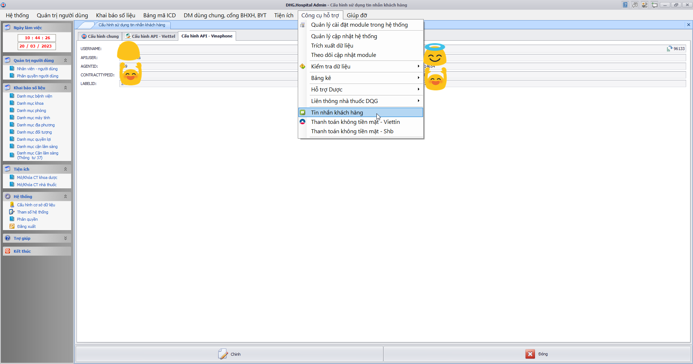

### DHG.Hospital Admin - Thông tin cập nhật

(✨: Chức năng mới,🐛: Chỉnh lỗi, #️⃣: Giải quyết công việc) 

- #️⃣: <https://github.com/dh-hos/Mo-ta-he-thong/issues/11> [OK]
- ✨: Xuất NGAY_YL, NGAY_KQ theo mô tả (#11) (Vinh - Mo ta cot [dien_bien] [hoi_chan] va [phau_thuat] XML5 - 20220602.3.pdf), lấy theo ngày giờ bắt đầu và kết thúc nếu có lập phiếu phẫu thuật [OK]

- #️⃣: <https://github.com/dh-hos/dhg.hospitaladmin/issues/17> [OK]
- 🐛: Lỗi khi Tạo lập bộ bảng lưu trữ cắt bỏ dữ liệu trực tiếp qua cơ sở dữ liệu khác (Admin -> tiện ích -> Cắt bỏ dữ liệu ra CSDL lưu trữ -> Kết chuyển dữ liệu trực tiếp -> Tạo lập bộ bảng lưu trữ) [OK]

- #️⃣: <https://github.com/dh-hos/dhg.hospitaladmin/issues/18> [OK]
- ✨: Cập nhật ngày giờ y lệnh trên xml 3 theo mô tả mới [OK]

- #️⃣: <https://github.com/dh-hos/DH.HIS/issues/2> [OK]
- 🐛: Bổ sung license mabvbh=77150 [OK]

- #️⃣: <https://github.com/dh-hos/Mo-ta-he-thong/issues/12> [OK]
- ✨: Thực hiện theo Mô tả thực hiện Thông tư 36/2021/TT-BYT [Mô tả](https://github.com/dh-hos/Mo-ta-he-thong/files/9553579/Vinh.-.Mo.ta.cap.phat.thuoc.nguoi.benh.Lao.theo.TT36.va.CV3153.-.17-08-2022v2.pdf) [OK]

- #️⃣: <https://github.com/dh-hos/DH.HIS/issues/4> [OK]
- ✨: Cập nhật bản quyền đối với Mã BV 87190 - BỆNH VIỆN DA LIỄU ĐỒNG THÁP [OK]

- #️⃣: <https://github.com/dh-hos/Mo-ta-he-thong/issues/12> [OK]
- ✨: Hỗ trợ không cập nhật lại kết quả chuẩn đoán đối với bệnh nhân Lao theo Thông tư 36/2021/TT-BYT (đã ghi nhận khi in phiếu 01) khi xem XML hoặc gửi XML lên cổng BHXH [OK]
- ✨: Thực hiện theo Mô tả thực hiện Thông tư 36/2021/TT-BYT [Mô tả](https://github.com/dh-hos/Mo-ta-he-thong/files/9553579/Vinh.-.Mo.ta.cap.phat.thuoc.nguoi.benh.Lao.theo.TT36.va.CV3153.-.17-08-2022v2.pdf) [OK]
- #️⃣: <https://github.com/dh-hos/dhg.hospitaladmin/issues/21> [OK]
- ✨: Hỗ trợ xóa XML (không có chi phí gửi BHXH) trên bảng kê kiểm tra XML [OK]

- #️⃣: <https://github.com/dh-hos/dhg.hospitaladmin/issues/20> [OK]
- #️⃣: Fix lỗi không thể xem chi tiết trên form gửi dữ liệu liên thông Dược Quốc Gia  [OK]

- #️⃣: <https://github.com/dh-hos/dhg.hospitaladmin/issues/22> [OK]
- ✨: Thực hiện cấu hình kết nối với thẻ khám bệnh viettin [OK]

- #️⃣: <https://github.com/dh-hos/dhg.hospitaladmin/issues/23> [OK]
- 🐛: Fix lỗi không theo mô tả [Vinh.-.Mo.ta.cap.phat.thuoc.nguoi.benh.Lao.theo.TT36.va.CV3153.-.17-08-2022v2](../MoTaThayDoi/Vinh.-.Mo.ta.cap.phat.thuoc.nguoi.benh.Lao.theo.TT36.va.CV3153.-.17-08-2022v2.pdf). Xử lý chỉ cần psdangky.benhnhan_lao = 1 không cần chuẩn đoán Z22.7 sẽ thực hiện xuất xml theo MA_LYDO_VVIEN=7, MA_LOAI_KCB=7 [OK]

- ✨: Hỗ trợ xuất XML theo mô tả [MÃ HÓA HÌNH THỨC KHÁM BỆNH, CHỮA BỆNH ĐỐI VỚI BỆNH NHÂN ĐIỀU TRỊ NỘI TRÚ 4h TRỞ XUỐNG](https://github.com/dh-hos/Mo-ta-he-thong/blob/main/XML4210/Hau-Mo-ta-XML-Noi-tru-4h-3788_BYT-BH.md) [OK]
- #️⃣: <https://github.com/dh-hos/Mo-ta-he-thong/issues/18> [OK]

- ✨: Cập nhật bản quyền đối với Mã BV 92137; 77154 [OK]
- #️⃣: <https://github.com/dh-hos/dhg.hospitaladmin/issues/25> [OK]
- #️⃣: <https://github.com/dh-hos/Mo-ta-he-thong/issues/21> [OK]

- ✨: Cập nhật bản quyền đối với Mã BV 87192; 87196 [OK]
- #️⃣: <https://github.com/dh-hos/dhg.hospitaladmin/issues/27> [OK]

- ✨: Cập nhật thêm chức năng cấu hình tham số kết nối gửi tin nhắn đối với Vinaphone  [OK]

- ✨: Bổ sung chức năng xuất xml tự động gửi lên cổng Sở y tế Đồng Tháp (87196 - cs2 bv Thanh Bình) [OK]
- #️⃣: <https://github.com/dh-hos/dhg.hospitaladmin/issues/28> [OK]

- ✨: Bổ sung chức năng xuất xml tự động gửi lên cổng Sở y tế Đồng Tháp (87197 - cs2 bv Lấp Vò) [OK]
- #️⃣: <https://github.com/dh-hos/dhg.hospitaladmin/issues/29> [OK]

- ✨: Bổ sung check box để xác định Phẫu thuật thuộc phương pháp vô cảm gây tê, phục vụ cho việc THANH TOÁN PHẪU THUẬT SỬ DỤNG PHƯƠNG PHÁP VÔ CẢM GÂY TÊ.  [OK]
- #️⃣: <https://github.com/dh-hos/dhg.hospitaladmin/issues/32> [OK]

- 🐛: Fix lỗi gán thẻ khi thanh toán không tiền mặt bằng thẻ Viettinbank v2 [OK]
>
- ✨: Hỗ trợ mở rộng độ dài mã máy thực hiện cận lâm sàng [OK]
- #️⃣: <https://github.com/dh-hos/dhg.hospitaladmin/issues/35> [OK]
>
- ✨: Bổ sung xuất XML theo [Mô tả Phẫu thuật thuộc phương pháp vô cảm gây tê](https://github.com/dh-hos/Mo-ta-he-thong/blob/main/XML4210/20230415-Hau-CV1731-BHXH-G%C4%90%C4%90T-Thanh-toan-phau-thuat-vo-cam-gay-te.md) [OK]
- #️⃣: <https://github.com/dh-hos/dhg.hospitaladmin/issues/32> [OK]
>
- 🐛: Fix lỗi thiếu "[gây tê]" sau tên vật tư trên XML3 [OK]
- #️⃣: <https://github.com/dh-hos/dhg.hospitaladmin/issues/32> [OK]
>
- 🐛: Fix lỗi ghi nhận sai MA_DICH_VU và TEN_DICH_VU đối với thuốc khi có Phẫu thuật phương pháp vô cảm, những trường hợp này giữ nguyên MA_VAT_TU và TEN_VAT_TU. [OK]
- #️⃣: <https://github.com/dh-hos/dhg.hospitaladmin/issues/32#issuecomment-1535670102> [OK]
>
- 🐛: Fix lỗi thiếu _GT đối với thuốc sử dụng cho Phẫu thuật phương pháp vô cảm. [OK]
- #️⃣: <https://github.com/dh-hos/dhg.hospitaladmin/issues/32#issuecomment-1535851292> [OK]
>
- ✨: Thực hiện xuất XML3, lấy tất cả mã nhân viên chỉ định và thực hiện cận lâm sàng, ekip phẫu thuật [OK]
- #️⃣: <https://github.com/dh-hos/dhg.hospitaladmin/issues/31> [OK]
- #️⃣: <https://github.com/dh-hos/Mo-ta-he-thong/blob/main/XML4210/Vinh-Mo-ta-XML4210-XML3.MA_BAC_SI.md> [OK]
>
- 🐛: Kiểm tra trùng MA_BAC_SI trong XML3 khi lấy tất cả bác sĩ theo [Mô tả](https://github.com/dh-hos/Mo-ta-he-thong/blob/main/XML4210/Vinh-Mo-ta-XML4210-XML3.MA_BAC_SI.md) [OK]
- #️⃣: <https://github.com/dh-hos/dhg.hospitaladmin/issues/37> [OK]
>
- 🐛: Thay đổi MA_THUOC trong XML2 đối với những thuốc sử dụng cho Phẫu thuật phương pháp vô cảm, theo [Mô tả](https://github.com/dh-hos/Mo-ta-he-thong/blob/main/XML4210/Vinh-Mo-ta-XML4210-XML3.MA_BAC_SI.md) [OK]
- #️⃣: <https://github.com/dh-hos/dhg.hospitaladmin/issues/36> [OK]
